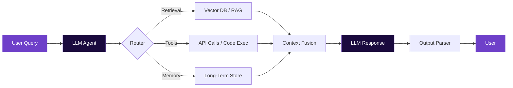

<div align="center">


<a href="https://git.io/typing-svg">
  
</a>

<br/><br/>


&nbsp;

&nbsp;

&nbsp;


</div>

---

## 👾 About Me

<table border="0" width="100%">
<tr>
<td width="55%" valign="top">

```python
class LordLLM:
    def __init__(self):
        self.name          = "Lord LLM"
        self.roles         = [
            "AI/ML Engineer",
            "LLM Systems Architect",
            "Data Scientist"
        ]
        self.stack_focus   = [
            "Large Language Models",
            "RAG Pipelines",
            "Multi-Agent Systems",
            "Vector Databases",
        ]
        self.languages     = ["Python 🐍", "Java ☕", "Bash 🖥️"]
        self.currently     = "Deep-diving into LangGraph & AutoGen"
        self.learning      = ["LoRA fine-tuning", "RLHF", "Self-RAG"]
        self.fun_fact      = "I debug models at 3am 🌙"
        self.open_to       = "Collaboration & open-source projects"

    def say_hi(self):
        print("Thanks for visiting! Let's build intelligent things.")

me = LordLLM()
me.say_hi()
```

</td>
<td width="45%" valign="top" align="center">


</td>
</tr>
</table>

---

## ⚡ What I Build

<div align="center">

|  AI Agents |  Data Science |  Knowledge Systems |  MLOps & APIs |
|:---:|:---:|:---:|:---:|
| RAG Chatbots | ML from Scratch | Vector Databases | Model Deployment |
| LLM Pipelines | Time-Series Forecasting | FAQ & QA Systems | FastAPI Backends |
| Multi-Agent Systems | Classification Models | Semantic Search | CI/CD for ML |
| Tool-Calling Agents | EDA & Visualization | Embedding Pipelines | Dockerized Services |
| ReAct / Chain-of-Thought | Anomaly Detection | Hybrid Retrieval | Inference Optimization |

</div>

---

## 🛠️ Tech Stack

<div align="center">

### 🐍 Languages
<p>
  
</p>

### 🤖 AI · ML · Deep Learning
<p>
  
  &nbsp;
  
  
  
  
  
  
</p>

### 🗄️ Vector Databases & Storage
<p>
  
  
  
  
  
  
  
</p>

### 📊 Data Science & Analytics
<p>
  
  
  
  
  
  
</p>

### 🔧 Backend, DevOps & Cloud
<p>
  
</p>

### 📈 MLOps & Experiment Tracking
<p>
  
  
  
  
</p>

</div>

---

## 📊 GitHub Analytics

<div align="center">


&nbsp;


</div>

<br/>

<div align="center">

</div>

---

## 🔭 Current Focus

<div align="center">

```
┌─────────────────────────────────────────────────────────────────────────────────┐
│                                                                                 │
│   🧪  Experimenting with multi-agent LLM frameworks (LangGraph, AutoGen)       │
│   📚  Advanced RAG patterns → HyDE · FLARE · Corrective RAG · Self-RAG         │
│   🔬  Fine-tuning with LoRA / QLoRA on domain-specific datasets                │
│   🏗️  Building production-grade, observable AI pipelines                       │
│   🌐  Exploring agentic web browsing and tool-use at scale                     │
│   📡  Prompt engineering at the system level for consistent reasoning          │
│                                                                                 │
└─────────────────────────────────────────────────────────────────────────────────┘
```

</div>

---

## 🧩 LLM & AI Architecture I Work With

<div align="center">


```mermaid
graph LR
    A[User Query] --> B[LLM Agent]
    B --> C{Router}
    C -->|Retrieval| D[Vector DB / RAG]
    C -->|Tools| E[API Calls / Code Exec]
    C -->|Memory| F[Long-Term Store]
    D --> G[Context Fusion]
    E --> G
    F --> G
    G --> H[LLM Response]
    H --> I[Output Parser]
    I --> J[User]
    style A fill:#6e40c9,color:#fff
    style J fill:#6e40c9,color:#fff
    style B fill:#1a0a3e,color:#fff
    style H fill:#1a0a3e,color:#fff
```

</div>

---

## 📌 Featured Projects

<div align="center">

<a href="https://github.com/Lord-LLM">
  
</a>

</div>

> 💡 **Pinned repos are set from your GitHub profile** — pin your best RAG, agent, or ML projects there and they'll auto-display here.

---

## 🌊 Contribution Activity


---

## 🤝 Let's Connect

<div align="center">

<a href="https://linkedin.com/in/Lord-LLM">
  
</a>
&nbsp;
<a href="https://twitter.com/Lord_LLM">
  
</a>
&nbsp;
<a href="mailto:your@email.com">
  
</a>
&nbsp;
<a href="https://github.com/Lord-LLM">
  
</a>
&nbsp;
<a href="https://huggingface.co/Lord-LLM">
  
</a>

</div>

---

<div align="center">


<br/><br/>


</div>
