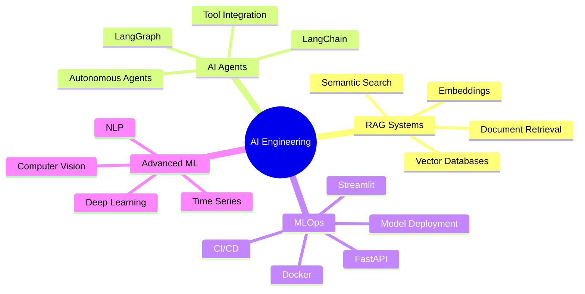

<div align="center">

# Hi there, I'm Enock 👋

### Data Scientist | ML Engineer | AI Enthusiast

*Building intelligent systems and exploring the intersection of data and AI*

[](https://linkedin.com/in/Lord-LLM)
[](mailto:katuienock@gmail.com)
[](#)

</div>

---

## 🎯 About Me

```python
class DataScientist:
    def __init__(self):
        self.name = "Enock"
        self.role = "AI/ML Engineer"
        self.location = "Nairobi, Kenya"
        self.interests = [
            "Machine Learning",
            "AI Agents",
            "Data Science",
            "MLOps"
        ]
        self.currently_learning = [
            "RAG Systems",
            "LangChain & LangGraph",
            "Production AI Deployment"
        ]
    
    def say_hi(self):
        print("Thanks for dropping by! Let's build something amazing together.")

me = DataScientist()
me.say_hi()
```

I'm passionate about leveraging AI and machine learning to solve real-world problems. With expertise in building end-to-end ML pipelines, I focus on creating intelligent systems that make a meaningful impact.

---

## 🚀 Featured Projects

<table>
<tr>
<td width="50%">
<h3 align="center">🤖 Mental Health AI Agent</h3>
<p align="center">

</p>
<p align="center">Intelligent mental health support system powered by LLMs, providing personalized assistance and resources.</p>
<p align="center">
<code>FastAPI</code> <code>Streamlit</code> <code>LangChain</code> <code>OpenAI</code>
</p>
<p align="center">
<a href="#">🔗 View Project</a> • <a href="#">📊 Live Demo</a>
</p>
</td>
<td width="50%">
<h3 align="center">📊 Retail Sales Forecasting</h3>
<p align="center">

</p>
<p align="center">Advanced time series forecasting system for retail sales prediction using ensemble ML models.</p>
<p align="center">
<code>Python</code> <code>Prophet</code> <code>XGBoost</code> <code>Pandas</code>
</p>
<p align="center">
<a href="#">🔗 View Project</a> • <a href="#">📈 Results</a>
</p>
</td>
</tr>
<tr>
<td width="50%">
<h3 align="center">🚢 Titanic Survival Predictor</h3>
<p align="center">

</p>
<p align="center">Machine learning classification model with comprehensive EDA and feature engineering.</p>
<p align="center">
<code>Python</code> <code>Scikit-learn</code> <code>Pandas</code> <code>Seaborn</code>
</p>
<p align="center">
<a href="#">🔗 View Project</a> • <a href="#">📓 Notebook</a>
</p>
</td>
<td width="50%">
<h3 align="center">🔬 Linear Regression from Scratch</h3>
<p align="center">

</p>
<p align="center">Custom implementation of linear regression with gradient descent, inspired by Andrew Ng's ML course.</p>
<p align="center">
<code>NumPy</code> <code>Pandas</code> <code>Matplotlib</code> <code>Math</code>
</p>
<p align="center">
<a href="#">🔗 View Project</a> • <a href="#">📝 Blog Post</a>
</p>
</td>
</tr>
</table>

---

## 🛠️ Tech Stack

<div align="center">

### Languages & Core ML


### ML/AI Frameworks


### Data & Analytics


### Tools & Platforms


### Databases


</div>

---

## 🌱 Currently Exploring



---

## 📊 GitHub Analytics

<div align="center">


<br><br>

</div>

---

## 🏆 Achievements

<div align="center">


</div>

---

## 📝 Latest Blog Posts

<!-- BLOG-POST-LIST:START -->
- 🤖 Building RAG Systems: A Practical Guide
- 📊 Time Series Forecasting with Prophet
- 🧠 Understanding Transformers from Scratch
- 🚀 Deploying ML Models with FastAPI
<!-- BLOG-POST-LIST:END -->

---

## 📫 Let's Connect

<div align="center">

[](https://linkedin.com/in/Lord-LLM)
[](https://twitter.com/Lord-LLM)
[](https://kaggle.com/Lord-LLM)
[](mailto:katuienock@gmail.com)

</div>

---

<div align="center">
  
### 💭 Random Dev Quote


### 📈 Profile Views


---


*✨ "Data is the new oil, but insights are the new gold." ⭐*

**Thanks for visiting! Let's turn data into action.** 🚀

</div>
